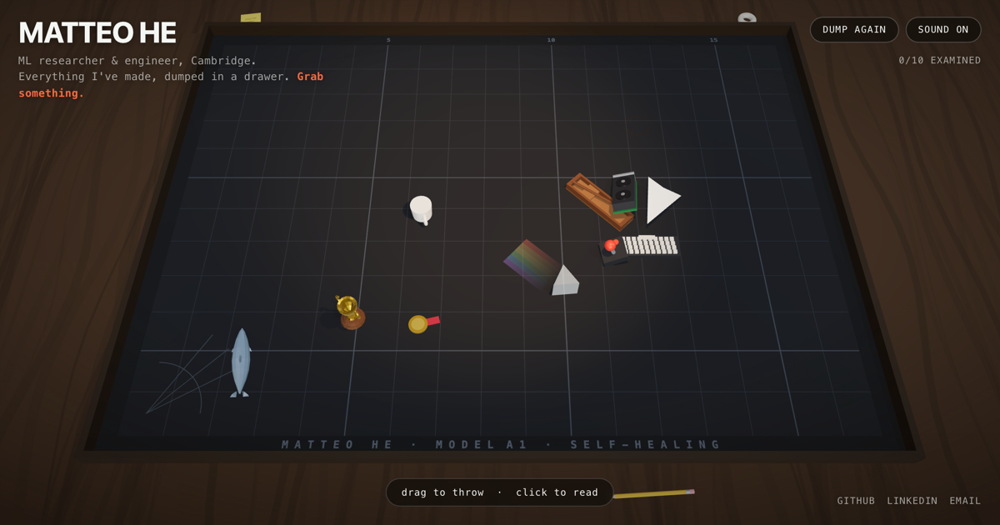

# hematteo.github.io

A personal research website for Matteo He, with AI-safety interests, selected interpretability research, education and distinctions, engineering experience, and a downloadable CV.

The original interactive 3D **physics junk drawer** lives at `/drawer/`. Click any object there to read the story behind it.

**Live:** https://hematteo.github.io



## Research profile

The homepage is semantic HTML with a locally hosted font. Paper summaries, links, and native expandable details work without JavaScript. A small module adds accessible figure enlargement; the 3D renderer loads only on `/drawer/`.

- Edit profile content in `index.html` and styles in `src/profile.css`.
- Figure enlargement and click-to-reveal contact: `src/profile.js`. Email obfuscation discourages simple harvesting; it is not access control. LinkedIn remains available without JavaScript.
- Public CV, citations, and research figures: `public/cv/` and `public/research/`.
- Website CV source: `cv-source/matteo-he-research.tex`. Compile with `latexmk -pdf -outdir=/tmp/website-cv cv-source/matteo-he-research.tex`, then copy the PDF to `public/cv/`. Use the public version with website contact; application CVs retain direct contact details separately.
- Content provenance and publication-status rules: `CONTENT_SOURCES.md`.
- The Vite build emits both `/index.html` and `/drawer/index.html`.

## The drawer

Websites aren't supposed to have weight. This one does. Instead of a scrolling list of bullet points, ten accomplishments are real rigid bodies in a tray with real physics — pick them up, throw them at the walls, tip the coffee mug and watch it spill. Read all ten and the drawer tells you you're done.

Each object maps to something real:

| Object | Stands for |
|---|---|
| 🛶 Punt | MPhil, University of Cambridge |
| ✈️ Paper airplane | *Learning to Read Out* (paper) |
| 🔺 Glass prism | *Sparse Readout Prism* (paper) |
| 🕹️ Joystick | Low-bit RL policies (paper) |
| ☕ Coffee mug | Solo-built LLM platform, ~3K MAU (it spills) |
| ⌨️ Keyboard | Amazon Alexa-AI internship |
| 🖥️ GPU | `vigil-gpu`, open-source training monitor |
| 🐬 Dolphin | Dolphin-acoustics ML (F1 0.48 → 0.86) |
| 🏆 Trophy | Hackathon wins |
| 🥇 Medal | Top Student Medal, GRE 340/340 |

## Built with

- **[three.js](https://threejs.org)** — WebGL rendering, all objects modelled in code (no asset files)
- **[cannon-es](https://github.com/pmndrs/cannon-es)** — rigid-body physics
- **[Vite](https://vitejs.dev)** — build and dev server
- **Web Audio API** — every clonk, chirp, and fanfare is synthesised at runtime; no audio files
- No external requests at runtime — fonts are system stacks, textures are drawn on `<canvas>`

## Features

- Grab / throw / stack physics with material-accurate collision sounds
- Coffee that spills and stains the mat when the mug tips
- Idle life: the paper airplane glides, the dolphin flops, the prism casts a rainbow
- Completion funnel: read all ten → confetti + a call to action
- Mobile: tilt-to-slide gravity (device orientation) and bottom-sheet cards
- Keyboard navigable, screen-reader announcements, respects `prefers-reduced-motion`
- Light/dark themes; renderer sleeps when the scene is at rest to save battery

## Develop

```bash
npm install
npm run dev        # local dev server
npm run build      # production build to dist/
npm run preview    # serve the built site
npm test           # drawer Playwright interaction suite
npm run smoke      # profile, responsive layout, CV, figures, and drawer smoke checks (used in CI)
```

Requires Node 18+. The full suite (`npm test`) uses your installed Chrome; CI uses Playwright's bundled Chromium.

## Deploy

Pushing to `main` builds and deploys to GitHub Pages via [`.github/workflows/deploy.yml`](./.github/workflows/deploy.yml). `.github/workflows/ci.yml` runs the smoke test on every push and PR.

## License

[MIT](./LICENSE) © Matteo He
