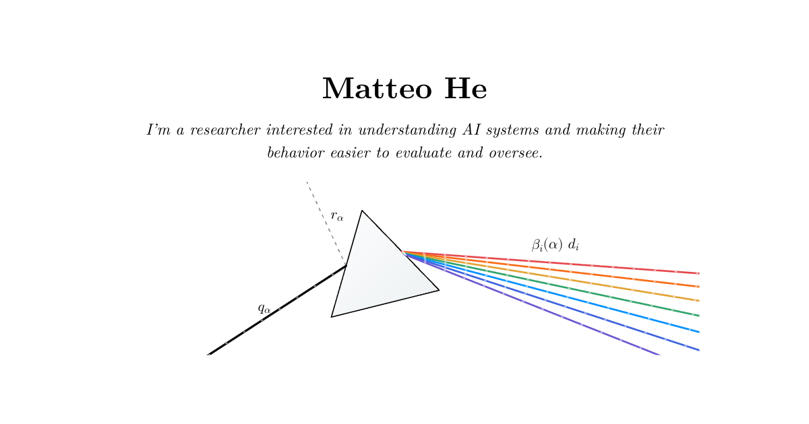

# hematteo.github.io

A personal research website for Matteo He, with AI-safety interests, selected interpretability research, education and distinctions, engineering experience, and a downloadable CV.

**Live:** https://hematteo.github.io



## Research profile

The homepage is semantic HTML typeset like a LaTeX preprint: Latin Modern, numbered sections, an abstract, a correspondence footnote, hyperref-style link borders (red in-page, cyan URLs, green BibTeX), and an arXiv-style margin stamp dated at build time by a small plugin in `vite.config.js`. Paper summaries, links, and native expandable details work without JavaScript.

- Edit profile content in `index.html` and homepage styles in `src/paper.css`. The research explainers (`/research/prism/`, `/research/trajectories/`) use `src/profile.css` and their page styles, with `src/paper-explorer.css` layered on top so they read as supplementary material. Fonts, colour tokens and link borders shared by every page live in `src/latex.css`.
- Fonts: `public/fonts/lmroman10-{regular,bold,italic}.woff2` and `lmmono10-regular.woff2` are Latin Modern Roman 10 and Mono 10 (GUST e-foundry, v2.005) converted to WOFF2 and subset to Latin text and punctuation; `lmmath-labels.woff2` is Latin Modern Math cut to the glyphs of the prism figures' labels and equations by `scripts/build-math-font.sh`. All under the GUST Font License (`public/fonts/GUST-FONT-LICENSE.txt`).
- Motion and graphics: `src/paper.js` loads the modules in `src/paper/`, styled by `src/paper-motion.css`. They cover the prism figure (Snell's-law refraction; pointer, touch drag or phone tilt), the Figure 1 replay from `public/research/trajectory-replay.json` (built by `scripts/build-replay-data.py`), the Sparse Readout Prism figure (`srp.js`), red-pen marks (`ink.js`), "??" references that resolve once per visit, and hover previews for in-text references. Everything respects reduced motion, and the page reads fully without JavaScript.
- Sparse Readout Prism figure: inline SVG in `index.html`, redrawn from the paper's schematic so it follows the theme; the figure link still opens the unaltered PNG. It plays once on first view (each feature arrow, then its bar) and pairs arrows with bars on hover.
- Phones (640px and below): `src/paper-mobile.css` and `src/paper-mobile.js`. A sticky running header shows the current section and opens a contents list, replacing the nav; without JavaScript the nav stays. Link rows get 44px tap areas, dates sit under headings, figures run edge to edge and open in a full-screen viewer with tap-to-zoom, and the explorers' score bars stack under their labels.
- Dark mode: colour tokens in `src/latex.css` follow the system setting. The nav's Dark/Light button (`src/theme.js`) stores a choice, which each page's head script applies before first paint; choosing what the system already prefers clears it. At night link boxes are a quiet grey, with colour only on hover and in the red pen. Plots the site draws (Figure 1, the trajectory explorer, the inline research charts) follow the theme through the `--plot-*` tokens, keeping viridis and the data colours unchanged; the paper's own PNG figures stay light plates, slightly dimmed, since they are unaltered copies (`CONTENT_SOURCES.md`).
- Apps (section 4): larger apps with their own domains and private repositories (3D Game of Life at `3dgameoflife.com`, Good Hand at `haopai.app`). The entries link out only; screenshots are in `public/apps/`.
- Small apps (section 5): each app is its own public repository with GitHub Pages enabled, which GitHub serves at `hematteo.github.io/<repository>/`, so Matrix Digital Rain (`hematteo/matrix-rain`) lives at `/matrix-rain/` and updates with its repo. To add one, publish its repo the same way and add an entry and a screenshot (`public/apps/`) to the section.
- Link previews: `public/share.png` (1200×630), rendered from the homepage by `scripts/render-share-image.mjs`.
- Submission history: the stamp's version and date, and its history popover, come from `git log --first-parent` at build time (`vite.config.js`). The deploy workflow fetches full history for this.
- Figure enlargement: `src/profile.js`. Direct email and LinkedIn links work without JavaScript.
- Public CV, citations, and research figures: `public/cv/` and `public/research/`.
- Website CV source: `cv-source/matteo-he-research.tex`. Compile with `latexmk -pdf -outdir=/tmp/website-cv cv-source/matteo-he-research.tex`, then copy the PDF to `public/cv/`. The public version uses the research contact address; application CVs are maintained separately.
- Content provenance and publication-status rules: `CONTENT_SOURCES.md`.
- The Vite build emits the homepage, `/research/prism/`, `/research/trajectories/`, and the unlisted `/drawer/`.

## Contact

The homepage and public CV use `matteohe.research@gmail.com`, as requested by Matteo. Email links open the visitor's mail application. There is no contact form, third-party delivery service, or reveal interaction.

## Develop

```bash
npm install
npm run dev        # local dev server
npm run build      # production build to dist/
npm run preview    # serve the built site
npm test           # drawer Playwright interaction suite
npm run smoke      # homepage, research pages, theme, figures, layout, CV and drawer checks (used in CI)

node scripts/render-share-image.mjs   # after a build: re-render public/share.png
scripts/build-math-font.sh            # re-cut lmmath-labels.woff2 (needs TeX Live and uv)
```

Requires Node 18+. The full suite (`npm test`) uses your installed Chrome; CI uses Playwright's bundled Chromium.

## Deploy

Pushing to `main` builds and deploys to GitHub Pages via [`.github/workflows/deploy.yml`](./.github/workflows/deploy.yml). `.github/workflows/ci.yml` runs the smoke test on every push and PR.

## The drawer (unlisted)

`/drawer/` is the site's original home: ten accomplishments as real rigid bodies in a tray, built with [three.js](https://threejs.org) and [cannon-es](https://github.com/pmndrs/cannon-es), every object modelled in code and every sound synthesised with the Web Audio API. It still builds and is tested (`npm test`), but nothing links to it and it is not in the sitemap.

| Object | Stands for |
|---|---|
| Punt | MPhil, University of Cambridge |
| Paper airplane | *Learning to Read Out* (paper) |
| Glass prism | *Sparse Readout Prism* (paper) |
| Joystick | Low-bit RL policies (paper) |
| Coffee mug | Solo-built LLM platform, ~3K MAU (it spills) |
| Keyboard | Amazon Alexa-AI internship |
| GPU | `vigil-gpu`, open-source training monitor |
| Dolphin | Dolphin-acoustics ML (F1 0.48 → 0.86) |
| Trophy | Hackathon wins |
| Medal | Top Student Medal, GRE 340/340 |

Grab, throw and stack objects; click one to read its story. Stories live once in the page's inventory, which is also the list view and the no-WebGL page. Object models are in `src/objects.js`, the scene in `src/main.js`, and eleven connected discoveries (a lamp and prism that split a beam, a paper plane that perches on the mug or flies on the GPU's updraft, a dolphin's echoes, a toy training run, and more) in `src/discoveries.js`, `src/flight.js` and `src/world-interactions.js`. The notebook gives one hint at a time and can arrange any pairing. It is keyboard navigable, follows the site's theme, and keeps every discovery in reduced-motion mode.

## License

[MIT](./LICENSE) © Matteo He
