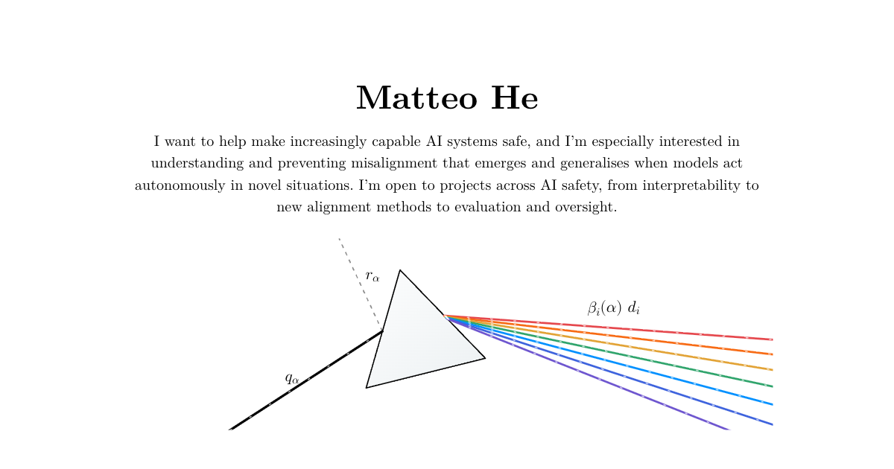

# hematteo.github.io

Matteo He's research website: papers, code and apps, typeset like a LaTeX preprint.

**Live:** https://matteohe.com



## Develop

```bash
npm install
npm run dev        # local dev server
npm run build      # production build to dist/
npm run smoke      # homepage, research pages, theme and layout checks (CI)
```

Node 18+. Pushing to `main` deploys to GitHub Pages ([`deploy.yml`](./.github/workflows/deploy.yml)); [`ci.yml`](./.github/workflows/ci.yml) runs the smoke test on every push and PR.

## Where things are

- `index.html`: homepage content. Styles in `src/paper.css`, phones in `src/paper-mobile.{css,js}`, and the fonts, colour tokens and link borders every page shares in `src/latex.css`.
- `src/paper/`: figure animations and page effects. All respect reduced motion, and the page reads without JavaScript.
- `research/prism/`, `research/trajectories/`: the paper explorers.
- `public/`: research figures, app screenshots and site icons.
- `scripts/`: data exports, the link-preview image (`render-share-image.mjs`) and the math font subset (`build-math-font.sh`).

## Adding an app

Vibe-coded art pieces are their own public repos with GitHub Pages, so they are served at `matteohe.com/<repo>/`. Larger apps live on their own domains. Either way, add an entry to the Apps or Vibe-coded art section of `index.html` and a 1200×750 screenshot to `public/apps/`.

## License

Code [MIT](./LICENSE) © Matteo He. Fonts in `public/fonts/`: Latin Modern under the [GUST Font License](./public/fonts/GUST-FONT-LICENSE.txt), DM Sans under the [OFL](./public/fonts/OFL.txt).
