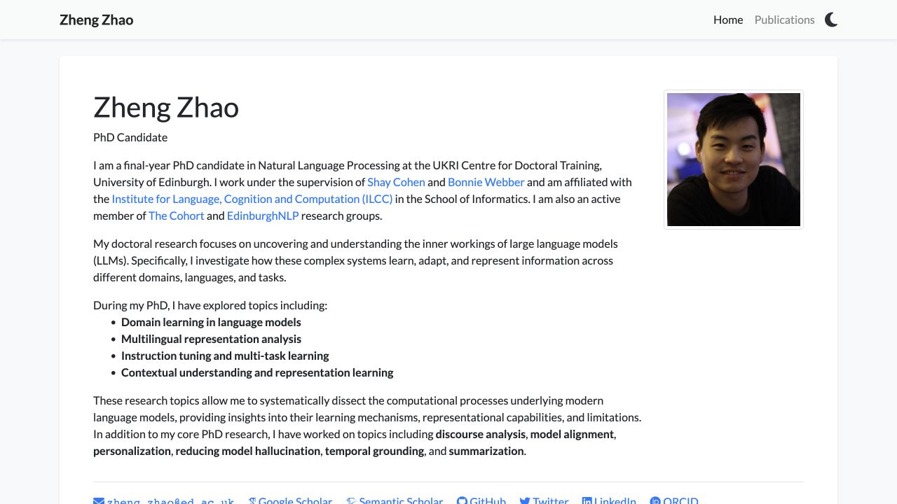
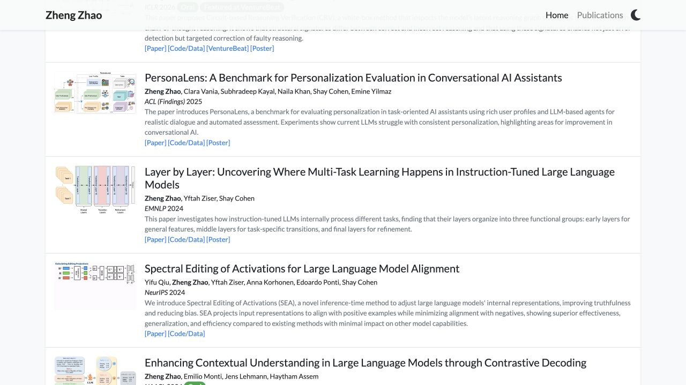
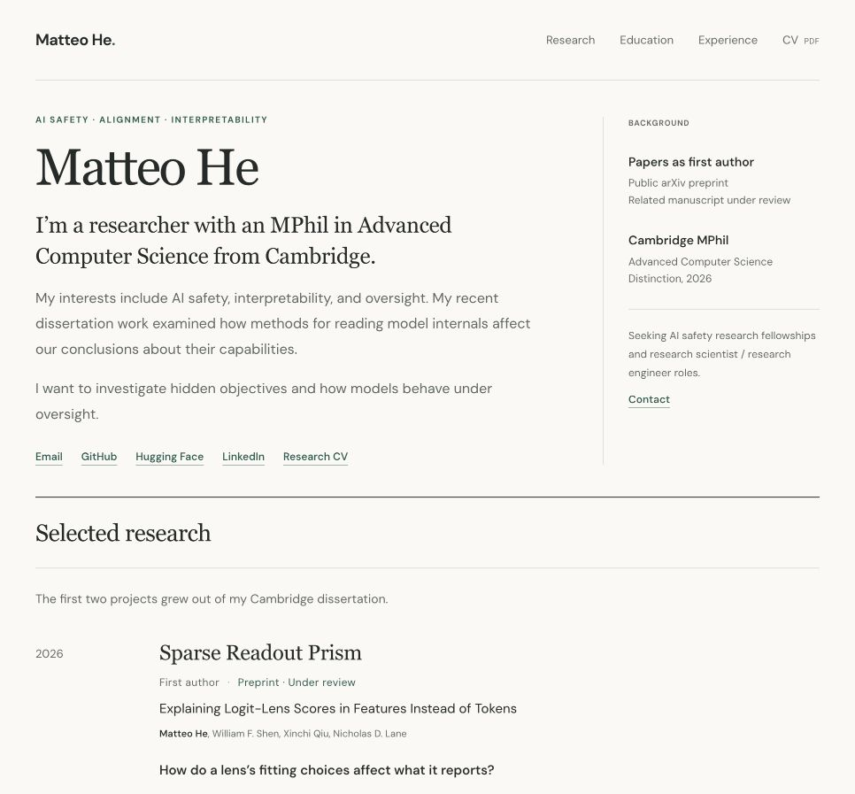

# Research profile reference review

Scope: desktop introduction and publication presentation on Zheng Zhao’s homepage, compared with Matteo’s current local homepage. Content references also include Neel Nanda’s About page and Jay Alammar’s visual explainers. This is an editorial and visual review, not a hiring outcome prediction or a complete accessibility audit.

## 1. Zheng Zhao: introduction — clear academic context, lengthy opening

Role, institution, supervisors and research groups are stated explicitly. A modest portrait makes the profile identifiable. The opening is long and includes broad introductory language; Matteo should retain a shorter introduction. Adopt the factual academic context and linked collaborators when the relationship is verified. Keep past Cambridge work clearly past.

## 2. Zheng Zhao: selected publications — consistent and easy to compare

Each row uses a thumbnail, title, authors, venue/status, short account of the work and relevant artifact links. Several papers can be scanned together. Matteo already has most of this metadata; the useful change is compact, consistent presentation. Keep the motivating research question and one or two sentences explaining the approach and finding. Preserve full explanations on the existing research pages. Some reference text and thumbnails are quite small, so adopt the structure without reducing readability.

## 3. Matteo: introduction and start of research — restrained style, repeated context

The cream background, dark green links and serif headings form a coherent visual style. Cambridge appears in the opening and sidebar; the dissertation context appears again above the papers. The sidebar devotes considerable space to credentials repeated elsewhere. Simplify the header, retain the clear availability statement, and make the research questions and papers visible sooner. Increase secondary text size where necessary instead of shrinking everything to gain density.

## Recommended changes

1. Short opening: current research interests, Cambridge background, one clear line about the opportunities sought. Describe the dissertation once as prior work.
2. Consistent paper rows: compact real figure preview, full title, authors, year/status, motivating question, short explanation, and the same ordering of available links. Retain truthful preprint/manuscript labels.
3. Present the two interactive pages as research explainers. Use descriptive links that explain what visitors will learn. Add no duplicated previews or new section merely to repeat them.
4. Add two concrete future research questions about hidden objectives and oversight, clearly labelled as interests. Replace the generic aspirational sentence rather than adding a longer biography.
5. Link verified academic profiles and collaborators. Add Google Scholar if Matteo has a populated profile; do not invent an account or imply a current affiliation.
6. Optional portrait. No image generation is necessary for a personal headshot.

Keep GRE and other distinctions in the education section. Add a small dated updates block only if there are a few meaningful public milestones and it will be maintained. No need for a separate all-publications page with the current volume.

Suggested order: introduction/contact → selected research with explainer links → future research questions → compact education and experience → contact.

Visual checks are limited to the captured desktop states. Keyboard traversal, contrast ratios and mobile reflow were not audited in this pass. Existing figure links and CV references were inspected in source, not exhaustively followed.

Sources: [Zheng Zhao](https://zsquaredz.github.io/), [Neel Nanda](https://www.neelnanda.io/about), [Jay Alammar](https://jalammar.github.io/).
